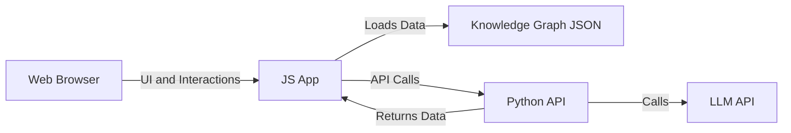

# MTG Deckbuilder MVP Architecture

- **JS App**: D3.js or Cytoscape.js for rendering and logic.
- **Python API**: Flask or FastAPI for backend logic (optional for MVP).
- **LLM API**: OpenAI, Anthropic, or local model (future/optional).